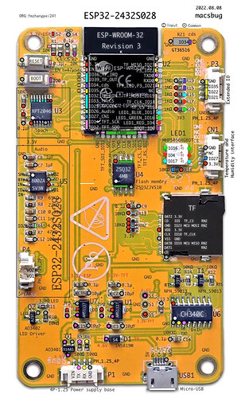
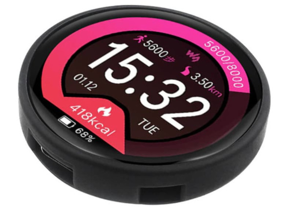

# ESPHome Weather Display

More information on my full weather station setup can be found in the [docs](docs) folder,
a good starting point is the [background document](docs/background.md).

As more devices are being added to the supported devices, the structure of this repository
has recently undergone some changes.   Common configuration and repeated code is being
migrated to includes and packages where appropriate.

The configurations here expect all network, api, web and portal configuration to be found
in an include file named **common_network.yaml** in the same directory.

Additionally the following packages are now included in this repository:

* `packages/ha_sensors.yaml` - sensors used by demo code from Home Assistant
* `packages/internal_sensors.yaml` - internal sensors (uptime, wifi signal)
* `packages/fonts.yaml` - common fonts, colours and characters

The packages/fonts.yaml file utilises substitutions to abstract the unicode needed, these 
substitutions can be included along with your top level substitutions using an inline include:

e.g:
```
substitutions:
  NODE: "Kitchen Display"
  TEXT_TITLE: "CatsLair"
  <<: !include packages/fonts_subs.yaml

```


# Buying a ready made display

## ESP32-2432S028


I recently picked up an Sunton ESP32-2432S028; integrated ILI1934, Touchscreen and ESP32 all-in-one
board as an easy way to deploy a second WX screen to the smart house.

See [ESP32-2432S028](docs/esp32-2432s028.md) for more information on this device.

This device also contains an LDR for display brightness adjustment, for this you can define an adjustment value, 
the voltage range and utilise auto\_dim.h.

The full ESPhome configuration, as used by my coffee table unit can be found at [esp32-2432s028.yaml](esp32-2432s028.yaml).

**This device is now fully supported by this code.**

## ESP32-2424S012



Another new addition to my devkit collection is the ESP32-2424S012, using a different TFT and touchscreen 
controller than the above board.

See [ESP32-2424S012](docs/esp32-2424s012.md) for more information on this device.

**Support of this device is a work in progress.**

* Touch screen is not currently working.
* Display is working, using a component that is included in this repository.


# Building the display

## Hardware Required

* ESP32 (example uses a DOIT DevKit V1)
* ESPhome compatible 240x320 TFT Screen (example uses an Adafruit ILI1934 2.8" TFT Touchscreen)

## Wiring


|ESP32|ILI1934|Description|
|-----|-------|-------|
|VCC  |VCC    |+3.3V Supply|
|GND  |GND    |Ground|
|D27  |CS     |TFT SPI Cable Select|
|D25  |RESET  |TFT Reset|
|D26  |DC     |TFT DC|
|D23  |SDI    |TFT SPI MOSI|
|D18  |SCK    |TFT SPI CLK|
|RX2  |LED    |TFT Backlight|
|D19  |SDO    |TFT SPI MISO|

* Touchscreen functionality coming soon.

## ESPHome Base Definitions

```
spi:
   - clk_pin: GPIO18
     mosi_pin: GPIO23
     miso_pin: GPIO19
     id: bus_tft

display:
  - platform: ili9xxx
    id: my_display
    spi_id: bus_tft
    reset_pin: GPIO25
    dc_pin: GPIO26
    cs_pin: GPIO27
    model: ili9341
    data_rate: 80MHz

```


# Expected Sensor Names

|ESPhome|Type|Description|My Sensor|
|-----|----|-----|-----|
|nettime|Time|Current Time|Homeassistant Time|
|outside\_temperature|Sensor|Outside Temperature (Balcony)|Holman via RTL433|
|outside\_humidity|Sensor|Outside Humidity (Balcony)|Holman via RTL433|
|barometric\_pressure|Sensor|Outside Barometric Pressure|Holman via RTL433|
|rain\_hr|Sensor|Rain Last Hour|WeeWX/Holman|
|rain\_today|Sensor|Rain Today|WeeWX/Holman|
|wind\_speed|Sensor|Balcony Windspeed|Holman via RTL433|
|inside\_temperature|Sensor|Inside Temperature (Lounge)|Xiaomi Air Purifier 3H|
|inside\_humidity|Sensor|Inside Humidity (Lounge)|Xiaomi Air Purifier 3H|
|kitchen\_temperature|Sensor|Kitchen Temperature|Xiaomi Aqara Temp/Humidity|
|kitchen\_humidity|Sensor|Kitchen Temperature|Xiaomi Aqara Temp/Humidity|
|bedroom\_temperature|Sensor|Bedroom Temperature|ESPhome SHT30|
|bedroom\_humidity|Sensor|Bedroom Temperature|ESPhome SHT30|
|bedroom\_pressure|Sensor|Bedroom Barometric Pressure|ESPhome BME280|
|bathroom\_temperature|Sensor|Bathroom Temperature|Xiaomi Aqara Temp/Humidity|
|bathroom\_humidity|Sensor|Bathroom Temperature|Xiaomi Aqara Temp/Humidity|
|aquarium\_temperature|Sensor|Aquarium Temperature|ESPHome Dallas DS18B20|
|pm2\_5|Sensor|Lounge Particulate Matter|Xiaomi Air Purifier 3H|
|tvoc|Sensor|Bedroom TVOC|ESPhome SGP30|
|eco2|Sensor|Bedroom eCO2|ESPhome SGP30|
|weather\_condition|Text|Current Conditions|OpenWeatherMap|
|moon|Sensor|Moon Phase|Home Assitant|
|sunrise|Sensor|Moon Phase|Home Assitant|
|sunset|Sensor|Moon Phase|Home Assitant|

Current conditions coded in the wx.yaml lambda function for the display convert OpenWeatherMap current conditions to a Material Iconset icon.
This can easily be adapted for other current conditions reporting.


# Get Started

Create a new ESPhome device

```
esphome wizard devicename.yaml
```

Edit the newly created devicename.yaml file, firstly adding the include file from this repository:

```
esphome:
  name: testscreen
  includes:
  - display_functions.h
```

All sensors used in the demo code can be found in the packages/ha_sensors.yaml and packages/internal.yaml files.

Download the fonts used in my example; it expects to find them in the fonts/ directory:

* fonts/alarm-clock.ttf - Alarm Clock (https://www.dafont.com/alarm-clock.font)
* fonts/futura.ttf - Futura (https://freefontsfamily.com/futura-font-family-free/)
* fonts/mdi.ttf - Material Icons (https://fonts.google.com/icons)
* fonts/arial.ttf - Arial 

Append the wx.yaml from this repository to your newly created ESPhome configuration.

# To Do

* Add media player controls/summary.
* Add light/switch controls.
* Add alarm panel.
* Design a 3D Printed Case.

