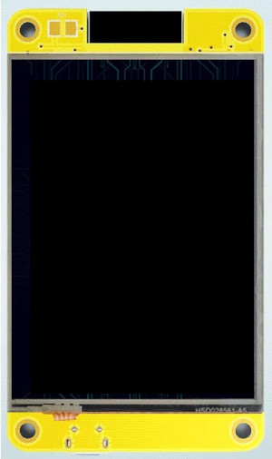

# ESPHome Projects

## Voice Assistant

Currently a work in progress but supporting the ESP32 Audio Kit/ES8388 as a Home Assistant
Satellite.

Confiugration can be [found here](/esp32-audio-kit.yaml).

Additional details can be found in the [ES8388 Component README](/components/es8388/README.md).

## Displays

I utilise these displays to show mostly show environmental information; you can find more info
on the background, structure and configuration of my sensor data for these displays at [docs/esphome-wx.md](/docs/esphome-wx.md)

### ESP32-2432S028

I recently picked up an Sunton ESP32-2432S028; integrated ILI1934, Touchscreen and ESP32 all-in-one
board as an easy way to deploy a second WX screen to the smart house.

See [ESP32-2432S028](docs/esp32-2432s028.md) for more information on this device.

This device also contains an LDR for display brightness adjustment, for this you can define an adjustment value, 
the voltage range and utilise auto\_dim.h.

The full ESPhome configuration, as used by my coffee table unit can be found at [esp32-2432s028.yaml](esp32-2432s028.yaml).

**This device is now fully supported by this code.**

### ESP32-2424S012

Another new addition to my devkit collection is the ESP32-2424S012, using a different TFT and touchscreen 
controller than the above board.

See [ESP32-2424S012](docs/esp32-2424s012.md) for more information on this device.

**Support of this device is a work in progress.**

* Touch screen is not currently working.
* Display is working, using a component that is included in this repository (forked and maintained for latest esphome).

### Build it yourself

See [Display DIY](docs/display-diy.md) for more information on building your own.

