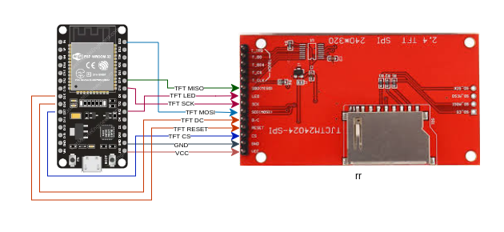

# ESPHome Weather Station


## Software

My local weather data is managed using WeeWX.

WeeWX is a free, open source, software program, written in Python, which interacts with your weather station to produce graphs, reports, and HTML pages. It can optionally publish to weather sites or web servers. It uses modern software concepts, making it simple, robust, and easy to extend. It includes extensive documentation.  (https://weewx.com)

WeeWX Interacts with Home Assistant using MQTT;  Home Assistant is the primary source of truth for current weather data;  While WeeWX performs conversions, averaging, some forecasting and historic data.

## Sensors/Data

* OpenWeatherMap
* Holman Weather Station (using RTL433 and an RTL-SDR)
* Xiaomi Aqara Temp/Humidity Sensors
* Xiaomi Air Purifier 3H
* ESPhome BME/Dallas OneWire/SHT Sensors
* ESPhome SGP30 Gas Sensors

More information on how these sensors and data are collected in Home Assistant and WeeWX is beyond the scope of building this display; but further details will be added soon.

# Building the Display

## Hardware Required

* ESP32 (example uses a DOIT DevKit V1)
* ESPhome compatible 240x320 TFT Screen (example uses an Adafruit ILI1934 2.8" TFT Touchscreen)

## Wiring



|ESP32|ILI1934|Description|
|-----|-------|-------|
|VCC  |VCC    |+3.3V Supply|
|GND  |GND    |Ground|
|D27  |CS     |TFT SPI Cable Select|
|D25  |RESET  |TFT Reset|
|D26  |DC     |TFT DC|
|D23  |SDI    |TFT SPI MOSI|
|D18  |SCK    |TFT SPI CLK|
|RX2  |LED    |TFT Backlight|
|D19  |SDO    |TFT SPI MISO|

* Touchscreen functionality coming soon.

## ESPHome Base Definitions

```
spi:
   - clk_pin: GPIO18
     mosi_pin: GPIO23
     miso_pin: GPIO19
     id: bus_tft

display:
  - platform: ili9xxx
    id: my_display
    spi_id: bus_tft
    reset_pin: GPIO25
    dc_pin: GPIO26
    cs_pin: GPIO27
    model: ili9341
    data_rate: 80MHz

```


# Expected Sensor Names

|ESPhome|Type|Description|My Sensor|
|-----|----|-----|-----|
|nettime|Time|Current Time|Homeassistant Time|
|outside\_temperature|Sensor|Outside Temperature (Balcony)|Holman via RTL433|
|outside\_humidity|Sensor|Outside Humidity (Balcony)|Holman via RTL433|
|barometric\_pressure|Sensor|Outside Barometric Pressure|Holman via RTL433|
|rain\_hr|Sensor|Rain Last Hour|WeeWX/Holman|
|rain\_today|Sensor|Rain Today|WeeWX/Holman|
|wind\_speed|Sensor|Balcony Windspeed|Holman via RTL433|
|inside\_temperature|Sensor|Inside Temperature (Lounge)|Xiaomi Air Purifier 3H|
|inside\_humidity|Sensor|Inside Humidity (Lounge)|Xiaomi Air Purifier 3H|
|kitchen\_temperature|Sensor|Kitchen Temperature|Xiaomi Aqara Temp/Humidity|
|kitchen\_humidity|Sensor|Kitchen Temperature|Xiaomi Aqara Temp/Humidity|
|bedroom\_temperature|Sensor|Bedroom Temperature|ESPhome SHT30|
|bedroom\_humidity|Sensor|Bedroom Temperature|ESPhome SHT30|
|bedroom\_pressure|Sensor|Bedroom Barometric Pressure|ESPhome BME280|
|bathroom\_temperature|Sensor|Bathroom Temperature|Xiaomi Aqara Temp/Humidity|
|bathroom\_humidity|Sensor|Bathroom Temperature|Xiaomi Aqara Temp/Humidity|
|aquarium\_temperature|Sensor|Aquarium Temperature|ESPHome Dallas DS18B20|
|pm2\_5|Sensor|Lounge Particulate Matter|Xiaomi Air Purifier 3H|
|tvoc|Sensor|Bedroom TVOC|ESPhome SGP30|
|eco2|Sensor|Bedroom eCO2|ESPhome SGP30|
|weather\_condition|Text|Current Conditions|OpenWeatherMap|
|moon|Sensor|Moon Phase|Home Assitant|
|sunrise|Sensor|Moon Phase|Home Assitant|
|sunset|Sensor|Moon Phase|Home Assitant|


# Get Started

Create a new ESPhome device

```
esphome wizard devicename.yaml
```

Edit the newly created devicename.yaml file, firstly adding the include file from this repository:

```
esphome:
  name: testscreen
  includes:
  - display_functions.h
```

Create all the required sensors for the display based on the table above.  You can find a reference
in example-sensors.yaml.

Append the wx.yaml from this repository to your newly created ESPhome configuration.

