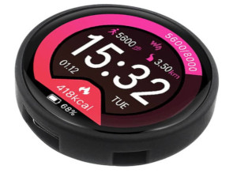

# Sunton ESP32-2432S028



Often sold as a "LVGL" development board.  [AliExpress](https://www.aliexpress.us/item/1005005453515690.html)

Full configuration can be found at [esp32-2424s012.yaml](../esp32-2424s012.yaml).


## ESP32

This devices uses a ESP32-C3; so some changes to the esp32 definitions are needed to use the right toolchain.
```
esp32:
  board: esp32-c3-devkitm-1
  variant: esp32c3
  framework:
    type: arduino
```

## SPI Bus

SPI bus utilised by the GC9A01 screen

```
spi:
  mosi_pin: GPIO7
  miso_pin: GPIO2
  clk_pin: GPIO6
```

The touchscreen on this device utilises the I2C bus; using GPIO4 and 5.

## I2C Bus

```
i2c:
 - sda: GPIO4
   scl: GPIO5
   scan: true
   id: bus_a
```

## Display

The GC9A01 is not yet supported by the ESPhome distribution; while there is a pull request the code from it 
does not work with recent versions of esphome.   You can find an updated version of this component that does
in this repository, the following yaml includes it:

```
external_components:
  - source: components
    components: ["gc9a01"]

```

More information on this external component can be found in it's [README](../components/gc9a01).

Now we utilise it as a display:

```
display:
  - platform: gc9a01
    cs_pin: GPIO10
    dc_pin: GPIO2
    update_interval: 50ms
    lambda: |-

```
* The lambda function for generating the weather station display can be found in the full yaml [esp32-2424s012.yaml](/esp32-2424s012.yaml)

### Backlight

```
output:
  - platform: ledc
    pin: GPIO3
    id: backlight_pin
```

* The TFT Backlight is on GPIO3 and defined using ledc and a monochromatic light

```
light:

  - platform: monochromatic
    output: backlight_pin
    name: "Display Backlight"
    id: back_light
    restore_mode: ALWAYS_ON

```

* Light components for the backlight with a default of ALWAYS\_ON


