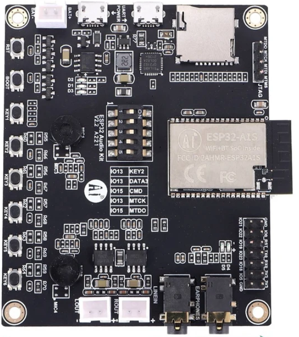

# ESP32 Audio Kit v2.2

Seems to be an AI Tinker clone sold frequently at [AliExpress](https://www.aliexpress.com/item/1005006081623609.html) for around $20AUD.

You can find a full esphome configuration for this board [here](/esp32-audio-kit.yaml).

## ESP32

This devices uses a ESP32-A1S which integrates an ES8388 audio codec chip, on the I2C bus at address 0x10.

## GPIOs

### Audio Functions

|GPIO|Function|Notes|
|----|--------|--------|
|21|Amplifier Enabled| |
|39|Headphone Sense Detect| |

### I2C

|GPIO|Function|Notes|
|----|--------|--------|
|32|I2C SCL| |
|33|I2C SDA| |

### I2S

|GPIO|Function|Notes|
|----|--------|--------|
|0|I2S MCLK| |
|25|I2S BCLK| |
|26|I2S DOUT| |
|27|I2S LRCLK| |
|35|I2S DIN| |

### Buttons and LEDs

|GPIO|Function|Notes|
|----|--------|--------|
|36|Key 1| |
|13|Key 2| |
|19|LED 2|Shared with Key 3|
|19|Key 3|Shared with LED 2|
|23|Key 4| |
|18|Key 5| |
|5|Key 6| |
|22|LED 1| |

### SD Card

Untested.

|GPIO|Function|Notes|
|----|--------|--------|
|2|SD Card DATA0| |
|4|SD Card DATA1| |
|12|SD Card DATA2| |
|13|SD Card DATA3|Shared with Key 2|
|14|SD Card CLOCK| |
|15|SD Card Command|Shared with JTAG|
|34|SD Card Detect| |

### System

|GPIO|Function|Notes|
|----|--------|--------|
|1,3|UART0| |
|16,17|UART1| |
|6-11|Internal Flash| |

