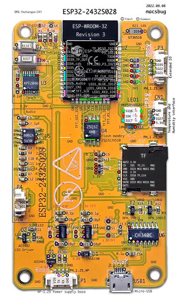

# Ready Made Devices

## Sunton ESP32-2432S028



Often sold as a "LVGL" development board.  [AliExpress](https://www.aliexpress.com/item/1005004502250619.html)

### ESPhome Configuration

```
esphome:
  name: screen
  includes:
  - display_functions.h
  on_boot:
    - lambda: |-
        uint8_t val = 0x40;
        uint8_t len = 1;
        my_display->send_command(esphome::ili9xxx::ILI9XXX_MADCTL, &val, len);

esp32:
  board: esp32dev
  framework:
    type: arduino

spi:
   - clk_pin: GPIO14
     mosi_pin: GPIO13
     miso_pin: GPIO12
     id: bus_tft

   - clk_pin: GPIO25
     mosi_pin: GPIO32
     miso_pin: GPIO39
     id: bus_ts

i2c:
   - sda: GPIO27
     scl: GPIO22
     scan: true
     id: bus_a


touchscreen:
  platform: xpt2046
  interrupt_pin: 36
  cs_pin: 33
  display: my_display
  id: my_touchscreen
  spi_id: bus_ts
  update_interval: 50ms
  report_interval: 1s
  threshold: 400
  calibration_x_min: 3775
  calibration_x_max: 404
  calibration_y_min: 3587
  calibration_y_max: 289
  swap_x_y: true
  on_touch:
    - lambda: |-
          ESP_LOGI("cal", "x=%d, y=%d, x_raw=%d, y_raw=%0d",
              id(my_touchscreen).x,
              id(my_touchscreen).y,
              id(my_touchscreen).x_raw,
              id(my_touchscreen).y_raw
              );


output:

  - platform: ledc
    pin: GPIO21
    id: backlight_pin

  - platform: ledc
    id: output_red
    pin: GPIO4
    inverted: true

  - platform: ledc
    id: output_green
    pin: GPIO16
    inverted: true

  - platform: ledc
    id: output_blue
    pin: GPIO17
    inverted: true

light:

  - platform: monochromatic
    output: backlight_pin
    name: "Display Backlight"
    id: back_light
    restore_mode: ALWAYS_ON

  - platform: rgb
    name: LED
    id: led
    red: output_red
    green: output_green
    blue: output_blue
    restore_mode: ALWAYS_OFF


sensor:
  - platform: adc
    pin: 34
    name: "Brightness"
    update_interval: 60s

display:
  - platform: ili9xxx
    id: my_display
    spi_id: bus_tft
    rotation: 90
    dc_pin: GPIO2
    cs_pin: GPIO15
    model: TFT_2.4R
    data_rate: 40MHz
    lambda: |-

```

The lambda function for generating the weather station display can be found in the main [wx.yaml](/wx.yaml)

