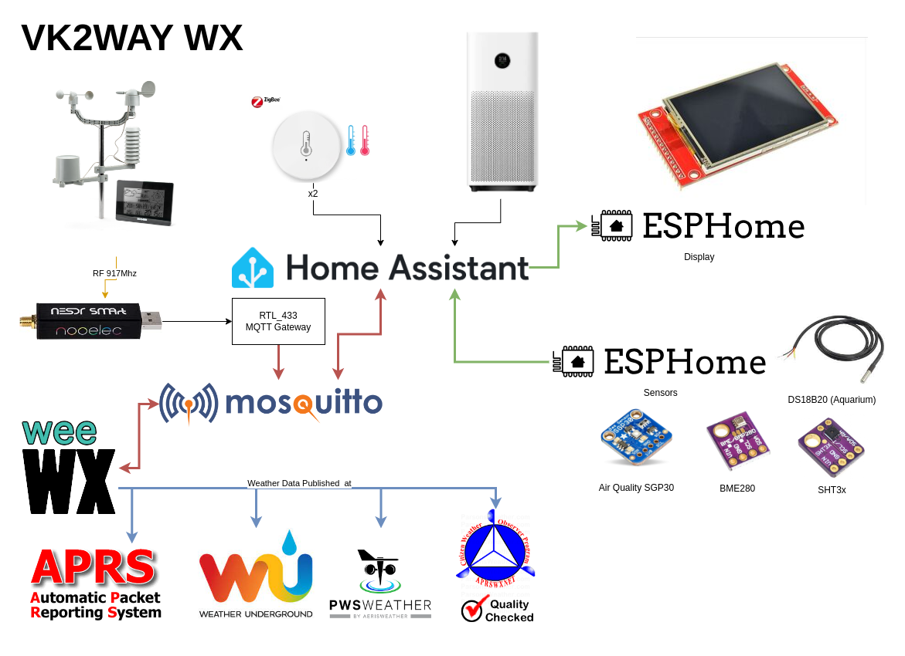

# Background

My local weather data is managed using a combination of Home Assistant and WeeWX.

WeeWX is a free, open source, software program, written in Python, which interacts with your weather station to produce graphs, reports, and HTML pages. It can optionally publish to weather sites or web servers. It uses modern software concepts, making it simple, robust, and easy to extend. It includes extensive documentation.  (https://weewx.com)

WeeWX Interacts with Home Assistant using MQTT;  Home Assistant is the primary source of truth for current weather data;  While WeeWX performs conversions, averaging, some forecasting and historic data.

## My Sensors/Data

* OpenWeatherMap
* Holman Weather Station ([my setup](holman433.md))
* Xiaomi Aqara Temp/Humidity Sensors
* Xiaomi Air Purifier 3H
* ESPhome BME/Dallas OneWire/SHT Sensors
* ESPhome SGP30 Gas Sensors

